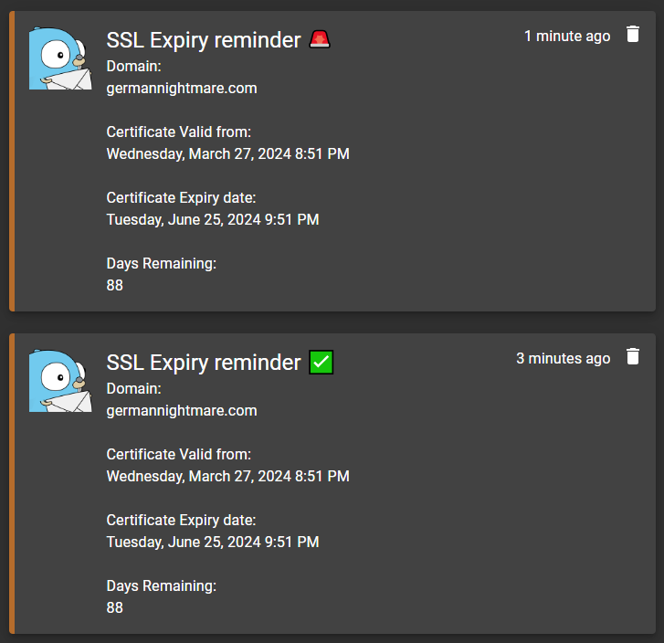
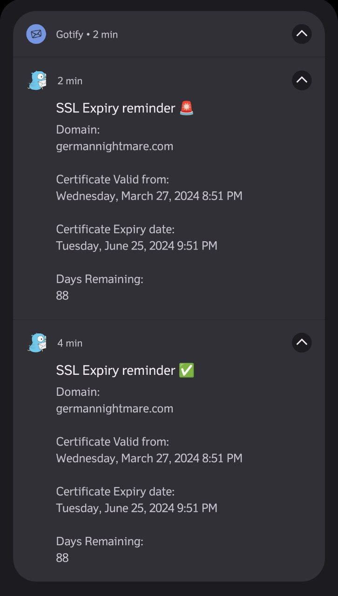

# SSL Expiry Reminder 🔔 Owner: mskian

[](https://github.com/mskian/ssl-expiry-reminder/actions)  

SSL Expiry Reminder and SSL Status Checker - Get SSL Expiry Notification reminder on Telegram and Gotify.  

## Gotify  
### Desktop
  

### Smartphone
  

## Telegram  

  

If you Like My Work then Buy a Coffee for me 😄  

[](https://www.buymeacoffee.com/santhoshveer)  

## ⚙ Requirements

- Node 14X LTS or 16X LTS
- Bash script to Run the Automated Tasks
- Telegram Bot - <https://core.telegram.org/bots>
- Gotify API - <https://gist.github.com/mcnaveen/2788985648490e7b3af24647247ed4e7#gistcomment-2996497>

## 🔧 Installation (docker) 🐳
Tip: If you don't want to have Telegram, for example, simply delete the line or in the compose variant comment it out with '#'

- Run via `docker run via docker hub image`
```bash
docker run -d \
    --name ssl_checker_01 \
    -e DOMAINS="domain1.com,domain2.com" \
    -e TELGRAM_TOKEN="your_telegram_token" \
    -e TELGRAM_CHAT_ID="your_telegram_chat_id" \
    -e GOTIFY_TOKEN="your_gotify_token" \
    -e GOTIFY_DOMAIN="your_gotify_domain" \
    -e REMAINDER_DAYS_TO_EXPIRE="7" \
    -e CHECKING_INTERVAL_IN_DAYS="7" \
    schecher/ssl-expiry-reminder
```

- Run via `docker compose via docker hub image`
```yaml
version: '3'
services:
  sslchecker:
    container_name: ssl_checker_01
    image: schecher/ssl-expiry-reminder
    environment:
      - DOMAINS=domain1.com,domain2.com
      - TELGRAM_TOKEN=your_telegram_token
      - TELGRAM_CHAT_ID=your_telegram_chat_id
      - GOTIFY_TOKEN=your_gotify_token
      - GOTIFY_DOMAIN=your_gotify_domain
      - REMAINDER_DAYS_TO_EXPIRE=7
      - CHECKING_INTERVAL_IN_DAYS=7
```

- Run via `docker run via source code`
```bash
git clone https://github.com/mskian/ssl-expiry-reminder.git

cd ssl-expiry-reminder

docker build -t sslreminder .

docker run -d \
    --name ssl_checker_01 \
    -e DOMAINS="domain1.com,domain2.com" \
    -e TELGRAM_TOKEN="your_telegram_token" \
    -e TELGRAM_CHAT_ID="your_telegram_chat_id" \
    -e GOTIFY_TOKEN="your_gotify_token" \
    -e GOTIFY_DOMAIN="your_gotify_domain" \
    -e REMAINDER_DAYS_TO_EXPIRE="7" \
    -e CHECKING_INTERVAL_IN_DAYS="7" \
    sslreminder
```

- Run via `docker compose via source code`
```bash
git clone https://github.com/mskian/ssl-expiry-reminder.git

cd ssl-expiry-reminder

nano docker-compose.yaml  [to edit the env vars]

docker compose up -d
```

## 🔧 Installation (normally)

- Clone this Repo via Git

```bash
git clone https://github.com/mskian/ssl-expiry-reminder.git
cd ssl-expiry-reminder
npm install
```

- Used as CLI

```bash
npm link
```

(OR)

- Install via `npm`

```bash
npm install -g ssl-expiry-reminder
```

```bash
$ checkssl -h
Usage: check [options]

Options:
  -V, --version                                      output the version number
  -d, --domain <domain name>                         Add domain without http/https (This Command line Argument for Automation Task)
  -s, --status <domain name>                         Add domain without http/https
  -g, --gotify <GOTIFY API URL>                      Gotify URL with Application Key
  -t, --telegram <Telegram API URL>                  Telegram API URL with your Bot Key
  -c, --chatid <Telegram Chat or Channel ID>         Telegram Channel ID or Chat ID
  -r, --remainder <Enter the Day Remaining 1 to 10>  Enter the Remaining Day to Get SSL Expiry Remainder Alert
  -h, --help                                         output usage information
```

- Next Store your Telegram & Gotify API by using this Below Command lines

```bash
$ Register Gotify API with URL
checkssl --gotify https://push.example.com/message?token=XXXXXXXXXXXXXXX
```

```bash
$ Register Telegram API URL and Botkey
checkssl --telegram https://api.telegram.org/bot<YOUR BOT API KEY>/sendMessage
```

```bash
$ Register Telegram your Chat id or Channel id
checkssl --chatid 123456789
```

- Testing - Execute the Script

```bash
checkssl --status example.com
```

- Test via `npx`

```sh
npx ssl-expiry-reminder -h
```

## 🕹 Usage

For Automation it having Seperate Command Line Argumet it will Send the Push Notification Alert via Telegram & Gotify

```bash
checkssl -d example.com
```

- Install the Bash Script for Automated Task
- Download the bash script on Any Location in your Server

```bash
wget https://raw.githubusercontent.com/mskian/ssl-expiry-reminder/master/sslcheck.sh
```

- Just Run the Bash file `sslcheck.sh`

```bash
chmod +x sslcheck.sh
```

```bash
./sslcheck.sh
```

- Replace mine Sites domain with your's <https://raw.githubusercontent.com/mskian/ssl-expiry-reminder/master/sslcheck.sh>
- Create Cron job for Automate checking

## 🛠 Customization

- Change SSL Remaining Day (Default Remaining day is 5)
- Add your Own 👇 Example

```bash
checkssl --remainder 2
```

## 📦 API Storage

- Your API Key's and URL's are stored on your Disk in `JSON File` Example File - <https://github.com/mskian/ssl-expiry-reminder/blob/master/config-example.json>
- Folder name - `ssl-expiry-reminder-nodejs` and File Name `config.json`
- You **No need** to create this File and Folder it will Automatically Generate & Store your Data's

Linux - `~/.config` in Home  
Windows - `AppData` Folder `c:\Users\username\AppData\Roaming\ssl-expiry-reminder-nodejs`  
macOS - `~/Library/Application Support`  

## 🖥 Supported OS

- I am using Linux also I am using Linux Cloud VPS Server (Ubuntu) I am testing it on both LTS Version on Ubuntu it's Working Well  

- Locally you can use this on your Desktop/laptop with Linux Distro/Windows/macOS  

- I Locally tested it on tested on Windows 10 it's Working well but Some users facing an issues like `checkssl is not recongized as an internal or external command, operable program or batch file`  if you are facing this issue on your Windows System Just uninstall & reinstall the Node.js LTS version & try again  

## 📖 Library

SSL Checker NPM Module - <https://github.com/mskian/ssl-checker-node-api>

## 🏗 Contributions

Your PR's are Always welcome 🦄

## 🐛 Bug Report

If you find any issues create an issue Ticket Here ✉   
<https://github.com/mskian/ssl-expiry-reminder/issues>

## ✅ License

- MIT

## 📃 Changelog

### v1.0.0.0
- Docker support was added
- Message has been edited (clearer)